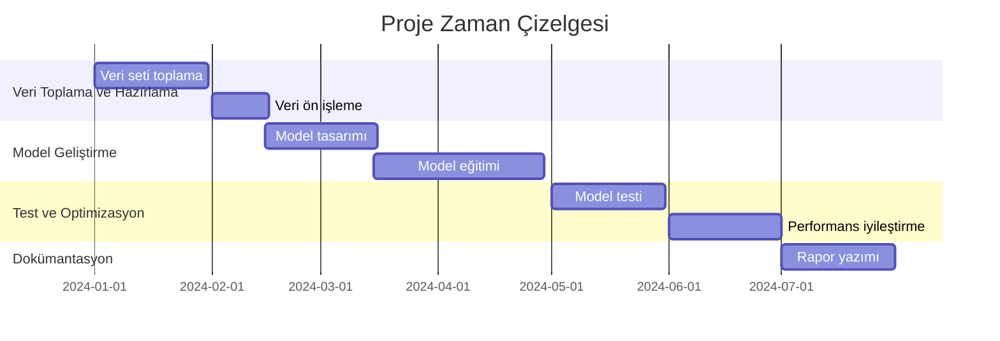

# Bitki Hastalıkları Tespit Sistemi
## Derin Öğrenme Tabanlı Görüntü İşleme Projesi

### 1. Ara Rapor: Proje Önerisi ve Planlama

#### Kapak Sayfası
**Proje Adı:** Derin Öğrenme Tabanlı Bitki Hastalıkları Tespit Sistemi  
**Öğrenci:** [Öğrenci Adı]  
**Danışman:** [Danışman Adı]  
**Teslim Tarihi:** [Tarih]

#### Proje Tanımı

##### Projenin Amacı ve Kapsamı
Bu proje, bitki yapraklarının görüntülerini analiz ederek hastalıkları tespit eden ve sınıflandıran bir yapay zeka sistemi geliştirmeyi amaçlamaktadır. Sistem, derin öğrenme algoritmaları kullanarak bitki yapraklarının görüntülerinden hastalık belirtilerini tanımlayabilmekte ve çiftçilere/bitki yetiştiricilerine erken uyarı sistemi sağlamaktadır.

##### Projenin Önemi ve Katma Değeri
- Tarımsal üretimde verimliliği artırma
- Erken hastalık tespiti ile ürün kayıplarını önleme
- Pestisit kullanımını optimize etme
- Sürdürülebilir tarım uygulamalarına destek
- Çiftçilere hızlı ve doğru teşhis imkanı sağlama

#### Literatür Özeti

1. **"Plant Disease Detection Using Deep Learning"** (Mohanty et al., 2016)
   - PlantVillage veri setinin oluşturulması
   - İlk derin öğrenme tabanlı bitki hastalığı tespit sistemi
   - %99.35 doğruluk oranı

2. **"Deep Learning for Plant Diseases: Detection and Classification"** (Ferentinos, 2018)
   - CNN mimarilerinin karşılaştırmalı analizi
   - Veri artırma tekniklerinin etkisi
   - Transfer öğrenme uygulamaları

3. **"A Review of Deep Learning Techniques for Plant Disease Detection"** (Zhang et al., 2020)
   - Güncel derin öğrenme modelleri
   - Veri seti hazırlama yöntemleri
   - Model optimizasyonu stratejileri

4. **"Real-time Plant Disease Detection Using Mobile Devices"** (Wang et al., 2019)
   - Mobil uygulama entegrasyonu
   - Gerçek zamanlı işleme teknikleri
   - Edge computing uygulamaları

5. **"Transfer Learning for Plant Disease Detection"** (Too et al., 2019)
   - Önceden eğitilmiş modellerin kullanımı
   - Veri seti boyutu optimizasyonu
   - Model performans karşılaştırmaları

#### Teknik Altyapı

##### Donanım Gereksinimleri
- GPU: NVIDIA GeForce RTX 3060 veya üzeri
- RAM: 16GB minimum
- Depolama: 500GB SSD
- İşlemci: Intel i7 veya AMD Ryzen 7

##### Yazılım Gereksinimleri
- İşletim Sistemi: Windows 10/11
- Python 3.8+
- TensorFlow 2.x
- OpenCV
- Flask (Web arayüzü için)
- CUDA Toolkit
- Git (Versiyon kontrolü)

#### Proje Zaman Çizelgesi

#### Beklenen Sonuçlar
- Yüksek doğruluk oranına sahip hastalık tespit sistemi
- Kullanıcı dostu web arayüzü
- Gerçek zamanlı tahmin yeteneği
- Detaylı hastalık raporlama sistemi
- Mobil uyumlu tasarım 