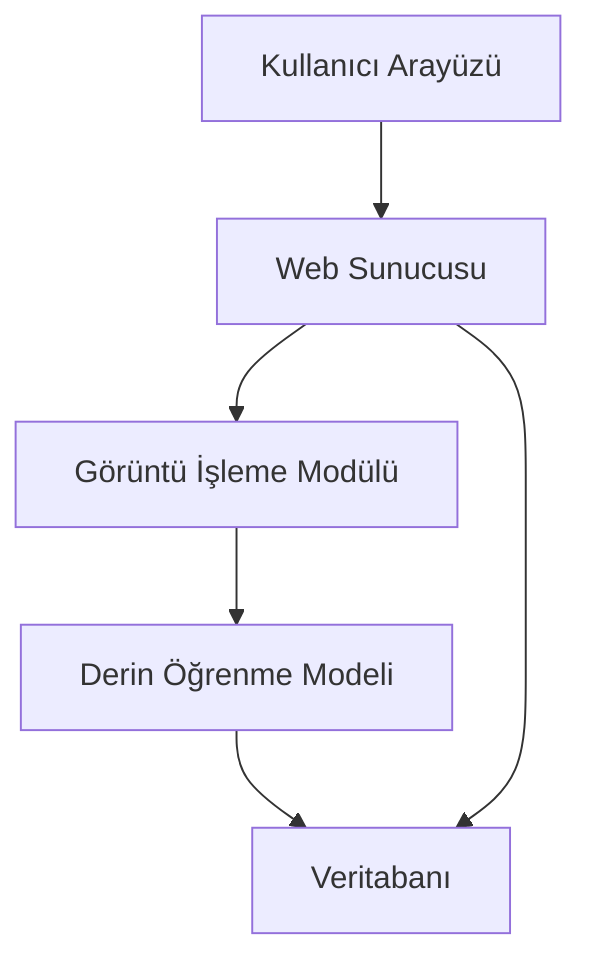
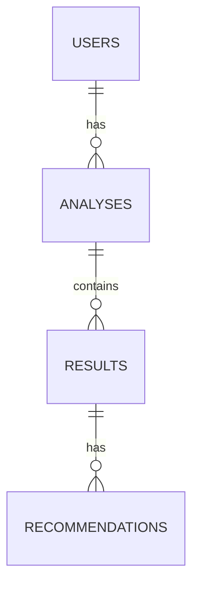
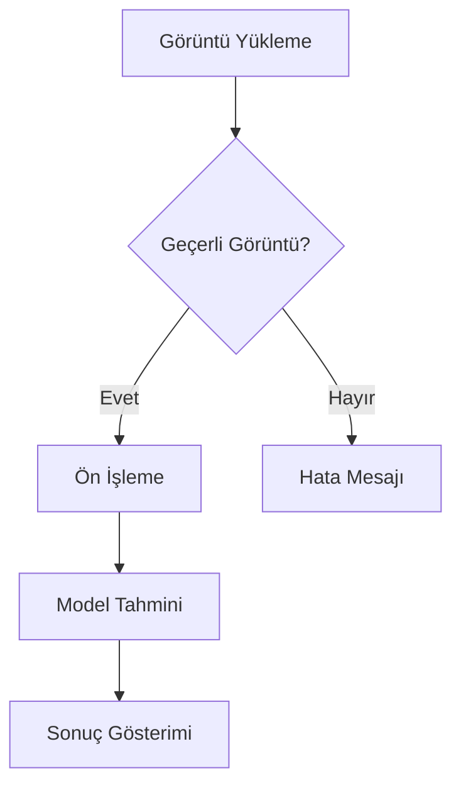

# Bitki Hastalıkları Tespit Sistemi
## Derin Öğrenme Tabanlı Görüntü İşleme Projesi

### 2. Ara Rapor: Analiz ve Tasarım

#### Giriş
İlk ara rapordan bu yana, projenin temel altyapısı oluşturulmuş ve ilk model eğitimleri gerçekleştirilmiştir. PlantVillage veri seti üzerinde çalışmalar başlatılmış ve temel model mimarisi geliştirilmiştir.

#### Detaylı Literatür Taraması

1. **"Deep Learning in Agriculture: A Survey"** (Kamilaris & Prenafeta-Boldú, 2018)
   - Tarımda yapay zeka uygulamaları
   - Derin öğrenme modellerinin karşılaştırması
   - Veri seti hazırlama yöntemleri

2. **"Plant Disease Detection Using CNN"** (Sladojevic et al., 2016)
   - CNN mimarilerinin detaylı analizi
   - Veri artırma teknikleri
   - Model optimizasyonu

3. **"Transfer Learning for Plant Disease Detection"** (Too et al., 2019)
   - Önceden eğitilmiş modellerin kullanımı
   - Veri seti boyutu optimizasyonu
   - Model performans karşılaştırmaları

4. **"Real-time Plant Disease Detection"** (Wang et al., 2019)
   - Gerçek zamanlı işleme teknikleri
   - Mobil uygulama entegrasyonu
   - Edge computing uygulamaları

5. **"Deep Learning for Plant Disease Detection"** (Ferentinos, 2018)
   - CNN mimarilerinin karşılaştırmalı analizi
   - Veri artırma tekniklerinin etkisi
   - Transfer öğrenme uygulamaları

#### Gereksinim Analizi

##### İşlevsel Gereksinimler
1. Görüntü Yükleme ve İşleme
   - Bitki yaprağı görüntüsü yükleme
   - Görüntü ön işleme
   - Görüntü boyutlandırma

2. Hastalık Tespiti
   - Derin öğrenme modeli ile analiz
   - Hastalık sınıflandırma
   - Güven skoru hesaplama

3. Raporlama
   - Hastalık tespit sonuçları
   - Tedavi önerileri
   - Geçmiş analizler

##### İşlevsel Olmayan Gereksinimler
1. Performans
   - Tahmin süresi < 2 saniye
   - %95+ doğruluk oranı
   - Eşzamanlı kullanıcı desteği

2. Güvenlik
   - Kullanıcı kimlik doğrulama
   - Veri şifreleme
   - Güvenli dosya yükleme

3. Kullanılabilirlik
   - Sezgisel arayüz
   - Mobil uyumluluk
   - Çoklu dil desteği

#### Tasarım

##### Sistem Mimarisi

##### Veritabanı Tasarımı

##### Arayüz Prototipleri
[Burada arayüz tasarımlarının ekran görüntüleri yer alacak]

##### Akış Diyagramları
